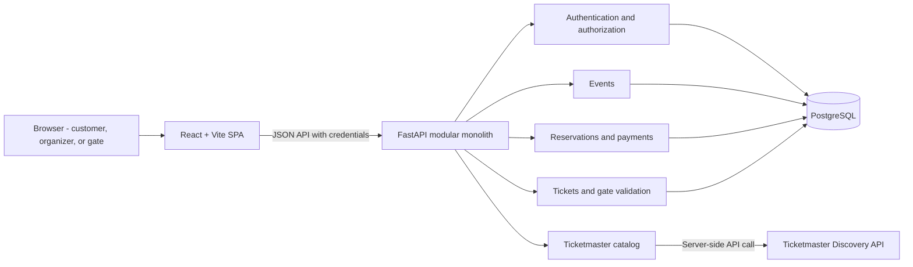
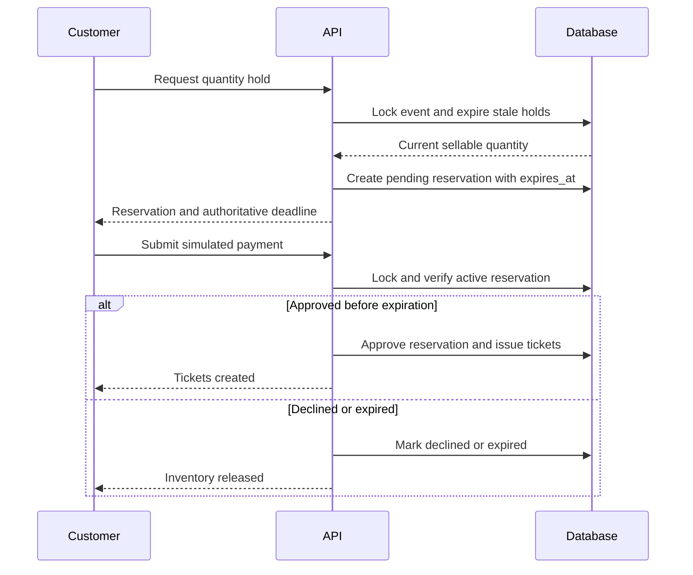

# Architecture Overview

## Architecture Style

The project uses a single repository containing a React single-page application and a FastAPI modular monolith. The backend owns business rules, authorization, external integration, persistence, and ticket validation.

The architecture deliberately avoids microservices, distributed messaging, a shared cross-language model package, and a generic enterprise layering framework. Feature modules may separate HTTP, application, and persistence responsibilities when that separation protects testability or business rules.

## Repository Organization

- `frontend/` contains the React application and its npm lockfile.
- `backend/` contains the FastAPI application, `pyproject.toml`, `uv.lock`, and generated `requirements.txt`.
- `docs/` is persistent project knowledge and architecture history.
- `compose.yaml` will be introduced with the database schema and will define local PostgreSQL for Podman Compose.
- `TODO.md` defines the ordered local commit plan.

No Git worktree is needed because there is no experiment or parallel implementation to isolate.

## Backend Modules

- **Auth:** credentials, opaque sessions, roles, and ownership checks.
- **Catalog:** Ticketmaster access and response normalization.
- **Events:** local event lifecycle, price, capacity, and publication.
- **Reservations:** temporary holds, expiration, inventory, and simulated payment.
- **Tickets:** issuance, HMAC credentials, sharing, and customer presentation.
- **Gate:** event-context validation and one-time consumption.

Pydantic models validate API boundaries. SQLAlchemy models represent persistence. Business decisions should not depend on browser state or external Ticketmaster response shapes.

## Frontend State

- TanStack Query owns remote server state and mutation invalidation.
- Local component state owns form input, transient UI state, and the visual countdown.
- Authentication is restored from the backend session endpoint.
- Redux or another general global state store is not introduced in the mandatory scope.

## Time and Concurrency

PostgreSQL time is authoritative for reservation expiration. The browser countdown is informational. Inventory and ticket-use decisions occur inside short database transactions; external network requests never run inside those transactions.

## Deployment Boundary

Provider selection is deferred until the mandatory local application works end to end. Production deployment must preserve HTTPS cookies, PostgreSQL connectivity, secrets, and same-site or CSRF protections.
