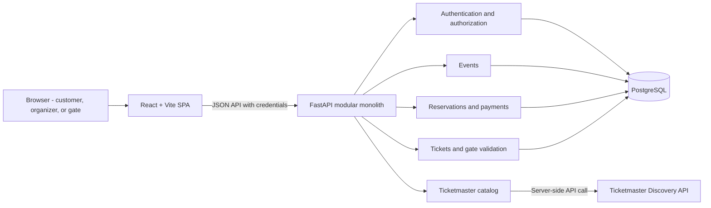
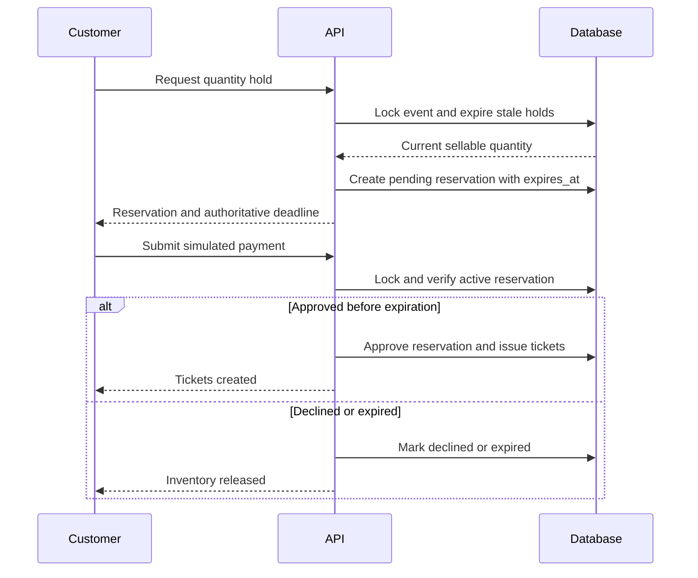
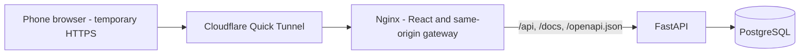

# Architecture Overview

## Architecture Style

The project uses a single repository containing a React single-page application and a FastAPI modular monolith. The backend owns business rules, authorization, external integration, persistence, and ticket validation.

The architecture deliberately avoids microservices, distributed messaging, a shared cross-language model package, and a generic enterprise layering framework. Feature modules may separate HTTP, application, and persistence responsibilities when that separation protects testability or business rules.

## Repository Organization

- `frontend/` contains the React application and its npm lockfile.
- `backend/` contains the FastAPI application, `pyproject.toml`, `uv.lock`, and generated `requirements.txt`.
- `docs/` is persistent project knowledge and architecture history.
- `compose.yaml` defines the local PostgreSQL, FastAPI, and built React services;
  `scripts/compose.ps1` provides provider-neutral database-only and full-stack Windows lifecycle
  commands for Docker or Podman.
- `TODO.md` defines the ordered local commit plan.

No Git worktree is needed because there is no experiment or parallel implementation to isolate.

## Backend Modules

- **Auth:** credentials, opaque sessions, roles, and ownership checks.
- **Catalog:** Ticketmaster access and response normalization.
- **Events:** local event lifecycle, price, capacity, and publication.
- **Reservations:** temporary holds, expiration, inventory, and simulated payment.
- **Tickets:** issuance, HMAC credentials, sharing, and customer presentation.
- **Gate:** published-event selection, event-context validation, and atomic one-time consumption.

Pydantic models validate API boundaries. SQLAlchemy models represent persistence. Business decisions should not depend on browser state or external Ticketmaster response shapes.

## Persistence Model

- Users have exactly one constrained role and own sessions or role-specific resources.
- Sessions store only a unique 32-byte token digest, never the raw cookie value.
- Each event owns one immutable Ticketmaster-style snapshot and local sellable attributes.
- Reservations record quantity, lifecycle state, and an authoritative expiration timestamp.
- Tickets are ordered uniquely within a reservation and record optional gate usage atomically.

Foreign keys establish ownership structure, while service-level authorization and cross-row business invariants remain explicit application responsibilities.

## Frontend State

- TanStack Query owns remote server state and mutation invalidation.
- Local component state owns form input, transient UI state, and the visual countdown.
- Authentication is restored from the backend session endpoint.
- Redux or another general global state store is not introduced in the mandatory scope.

Frontend modules remain feature-first. Route pages, API contracts, and feature utilities stay at a
feature root; supporting UI and hooks use local `components/` and `hooks/` directories only when
they exist. Cross-flow navigation belongs to the navigation feature, while generic primitive-value
formatters belong to `src/lib/`. This keeps a business change inside one subtree without returning
to an unstructured flat feature directory.

## Time and Concurrency

PostgreSQL time is authoritative for reservation expiration. The browser countdown is informational. Inventory and ticket-use decisions occur inside short database transactions; external network requests never run inside those transactions.

## Deployment Boundary

The mandatory application is complete for local evaluation through either host processes or the
three-service Compose topology. The frontend container serves the Vite build from Nginx and proxies
same-origin `/api` and documentation requests to FastAPI. The backend container applies migrations
and the idempotent seed before starting one Uvicorn process, and service health checks enforce
startup order.

An opt-in fourth `cloudflared` service gives a phone a temporary trusted HTTPS origin for physical
camera testing. It reaches only Nginx; FastAPI and PostgreSQL remain behind the browser gateway.

The tunnel is public, random, temporary, and dependent on an external development service; it is
not a production deployment. A later hosted topology must define permanent TLS termination,
managed secrets, access policy, database connection management, a separate migration owner, logs,
backups, monitoring, scaling, and rollback.
