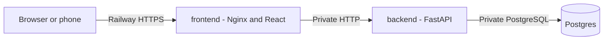

# Railway Deployment

## Status

The repository is prepared for Railway, but publication is a candidate-owned remote action. A
deployment earns the challenge differential only after a permanent public URL is created and
verified.

## Topology



Only `frontend` receives a public domain. It proxies `/api`, `/docs`, and `/openapi.json` to the
private backend, so the browser retains one origin and the opaque session cookie does not require a
cross-site configuration. Railway terminates public TLS; Nginx-to-FastAPI and FastAPI-to-PostgreSQL
traffic remain inside the project network.

## Prerequisites

- The reviewed local commits are pushed to a GitHub repository by the candidate.
- A Railway account is connected to that repository.
- No real user, payment, or event data is used; the seeded accounts are public evaluation data.

Do not upload `.env`, `backend/.env`, or any generated Compose environment file. Railway service
variables replace those files.

## Create the Project

1. Create an empty Railway project.
2. Add Railway PostgreSQL and name the service `Postgres`.
3. Add two empty services named exactly `backend` and `frontend`.
4. Configure the services before connecting the GitHub source where practical.

The names are significant because variable references use them. If a service is renamed, update
every `${{service.VARIABLE}}` reference that points to it.

## Configure the Backend Service

Connect the GitHub repository and configure:

| Setting | Value |
| --- | --- |
| Root Directory | `/backend` |
| Config File Path | `/backend/railway.toml` |
| Public domain | None |

The committed config selects `backend/Dockerfile`, runs Alembic and the idempotent seed as one
pre-deploy shell command, checks `/api/health`, and restarts only on failure. The explicit
`/bin/sh -c` is significant: `&&` is shell syntax, while a Dockerfile-based command may otherwise
execute only the first program rather than interpret the compound expression.

Add these service variables through the Railway Raw Editor:

```dotenv
PORT=8000
APP_ENV=production
DATABASE_URL=${{Postgres.DATABASE_URL}}
FRONTEND_ORIGIN=https://${{frontend.RAILWAY_PUBLIC_DOMAIN}}
SESSION_COOKIE_NAME=gather_session
SESSION_LIFETIME_SECONDS=604800
SESSION_COOKIE_SECURE=true
RESERVATION_LIFETIME_SECONDS=600
TICKET_HMAC_SECRET=replace-with-a-new-random-secret
TICKETMASTER_API_KEY=replace-with-the-evaluation-key
TICKETMASTER_TIMEOUT_SECONDS=5
```

The settings adapter selects the installed Psycopg 3 SQLAlchemy driver when Railway supplies a
generic `postgres://` or `postgresql://` URL. Generate a deployment-only signing secret locally:

```powershell
python -c "import secrets; print(secrets.token_urlsafe(32))"
```

Store only the generated value in Railway. Changing it later invalidates already-issued QR tokens.
`TICKETMASTER_API_KEY` is optional for the seeded event but required for live catalog search.

## Configure the Frontend Service

Connect the same GitHub repository and configure:

| Setting | Value |
| --- | --- |
| Root Directory | `/frontend` |
| Config File Path | `/frontend/railway.toml` |

Add these variables:

```dotenv
PORT=80
BACKEND_HOST=${{backend.RAILWAY_PRIVATE_DOMAIN}}
BACKEND_PORT=8000
```

Do not set `VITE_API_URL`; its image default is the same-origin `/api`. At container startup, the
official Nginx entrypoint substitutes only `BACKEND_HOST` and `BACKEND_PORT`. Local Compose keeps
the defaults `backend:8000`, while Railway resolves the referenced private domain.

In **Settings → Networking → Public Networking**, generate a Railway domain targeting port `80`.
If the dashboard requires an initial deployment before generating the domain, deploy the frontend
once, generate the domain, confirm the backend `FRONTEND_ORIGIN` reference, and redeploy backend and
frontend.

## First Deployment Order

1. Wait for `Postgres` to become healthy.
2. Deploy `backend` and confirm its pre-deploy migration and seed succeed. A fresh database reports
   `Seed completed: 4 users, 1 catalog snapshots, 1 events inserted.`; a repeated idempotent run
   reports zero insertions.
3. Deploy `frontend`.
4. Generate or confirm the frontend public domain and redeploy after any variable change.

The backend and database do not need public domains or TCP proxies.

## Verification

Open only the frontend Railway domain and verify:

1. `/health` returns `healthy`.
2. `/api/health` returns the FastAPI health response.
3. `/docs` loads Swagger through the same gateway.
4. Organizer login can open the seeded event management flow.
5. Customer login can reserve, approve payment, and open the issued QR.
6. Gate login can select the event and validate the QR once.
7. A phone can grant camera permission on the permanent HTTPS origin.
8. Refreshing the page restores the opaque session.

Record the verified public frontend URL in the challenge submission. Never submit a Quick Tunnel
URL as the hosted differential.

## Troubleshooting

### Frontend Returns `502 Bad Gateway`

- Confirm `BACKEND_HOST` rendered from `${{backend.RAILWAY_PRIVATE_DOMAIN}}`.
- Confirm `BACKEND_PORT=8000` and backend `PORT=8000`.
- Confirm both services are in the same Railway project environment.
- Check that the backend healthcheck is passing before redeploying the frontend.

### Backend Pre-Deploy Fails

- Confirm `DATABASE_URL` references the actual PostgreSQL service name.
- Inspect the pre-deploy logs for Alembic or connectivity errors.
- Do not replace the internal database reference with a public TCP URL.

If the log shows Alembic but no `Seed completed` line, the compound expression was not interpreted
by a shell. Confirm the deployed revision wraps both commands with `/bin/sh -c`. To repair an
already-running challenge database once, copy the backend SSH command from Railway and execute:

```text
railway ssh -s backend -e production -- python -m backend.database.seed
```

The manual command is safe to repeat because the seed is idempotent, but it does not replace the
versioned pre-deploy fix.

### Login Returns `500` After Accepting Seeded Credentials

If the backend log contains `usegmt option requires a UTC datetime`, the user and password were
accepted but Python could not serialize the database timezone object as an HTTP cookie date. The
application normalizes the aware database value to `datetime.UTC` at the cookie boundary. Deploy a
revision containing that normalization; rerunning the seed is unnecessary.

### Login Works but the Session Is Not Restored

- Confirm access is through the frontend HTTPS domain, not a backend URL.
- Confirm `APP_ENV=production` and `SESSION_COOKIE_SECURE=true`.
- Confirm browser requests use relative `/api` paths and are not redirected to another domain.

### Camera Cannot Start

- Confirm the address begins with `https://` and the certificate is valid.
- Grant camera permission to the Railway domain and close other applications using the camera.
- Keep manual code entry available if the evaluator has no usable camera.

## Rollback and Removal

Railway can redeploy a previous application deployment, but database migrations are persistent.
Never roll application code back across an incompatible schema without an explicit database plan.
The current migrations are additive and the seed is idempotent.

After the submission window, remove or suspend the public services if they are no longer needed to
avoid cost and continued exposure of the documented evaluation accounts. Rotate the Ticketmaster
credential if it was dedicated to this challenge.

## Official References

- [Deploying a monorepo](https://docs.railway.com/guides/deploying-a-monorepo)
- [Dockerfile builds](https://docs.railway.com/builds/dockerfiles)
- [Configuration as code](https://docs.railway.com/config-as-code)
- [PostgreSQL service variables](https://docs.railway.com/databases/postgresql)
- [Private networking](https://docs.railway.com/private-networking)
- [Public domains and target ports](https://docs.railway.com/networking/domains/working-with-domains)
- [Pre-deploy commands](https://docs.railway.com/deployments/pre-deploy-command)
